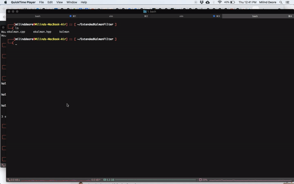

# Extended Kalman Filter
This extended-kalman-filter implementation is leveraged from [here](http://www.morethantechnical.com/2011/06/17/simple-kalman-filter-for-tracking-using-opencv-2-2-w-code/).

## Compile the code: 
You need to have `pkg-config` and `opencv` installed on your machine. 

<pre><code> g++ -std=c++11 ekalman.cpp `pkg-config --cflags --libs opencv` -o kalman
</code></pre>

## Demo:

